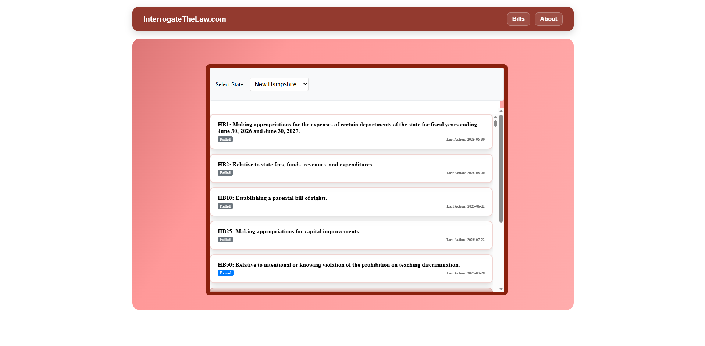

# InterrogateTheLaw.com

Browse and understand U.S. state and federal legislative bills with live updating bill text and AI‑powered summaries.

## Table of Contents
- [Overview](#overview)
- [Architecture](#architecture)
- [Screenshots / Demo](#screenshots--demo)
- [Quick Start](#quick-start)
- [Usage](#usage)
- [Configuration](#configuration)
- [Project Layout](#project-layout)
- [Roadmap](#roadmap)
- [Contributing](#contributing)
- [Performance](#performance)

## Overview
- Real‑time bill data and details per U.S. state (via LegiScanAPI).
- Clean bill pages: title, sponsors, status, history, and full text.
- Highlight → summarize: select text to get AI summaries with three levels (Brief, Standard, In Depth).
- Handles mixed formats: HTML bill text displays directly; PDFs are detected and shown via embedded viewer to avoid gibberish.
- New Hampshire loads by default; switch states from the list view.
- Simple, readable UI with consistent spacing and emphasis.

Primary users
- Journalists, policy analysts, advocates, and engaged citizens needing fast comprehension of bill language.

Project type
- Web app with a React frontend and Express service backend.

Tech highlights
- React 18, React Router, CRA tooling; Express API proxy to LegiScan.
- OpenAI integration for summarization.
- Node.js target: `16.x`.

## Architecture
- Browser loads the React app and navigates routes (`/`, `/bill/:billId`).
- Frontend requests bill lists/details/text through the backend proxy.
- Backend calls LegiScan for bill data and text; returns JSON/Base64 content.
- Summarization posts highlighted text and selected level to the backend; backend uses OpenAI to respond.

```mermaid
flowchart LR
  A[Browser (React)] -- GET /api/bills, /api/bill/:id, /api/bill/:id/text/:docId --> B[Express Backend]
  B -- LegiScan API --> C[(LegiScan)]
  A -- POST /api/summarize {text, level} --> B
  B -- OpenAI Chat Completions --> D[(OpenAI)]
  A <-- JSON / HTML / Base64 --> B
```

Key components
- `src/components/BillsList.js`: State selector, bill list, navigation.
- `src/components/BillDetailPage.js`: Bill view, history, full text, highlight‑to‑summarize popup.
- `backend/server.js`: Express endpoints for LegiScan proxy and summarization.

## Screenshots / Demo
### App overview: 

### Bill detail page: 

### Summary popup: 


## Usage
Frontend
- Navigate to `/` to view bills for the default state (NH).
- Click a bill to view details; highlight any text; choose a level; click “Click to generate summary”.

Backend API

Endpoints
- `GET /api/bills?state=<STATE>&status=<optional>` — Master list for a state.
- `GET /api/bill/:id` — Bill details.
- `GET /api/bill/:id/text/:docId` — Bill text (Base64 payload as returned by LegiScan).
- `POST /api/summarize` — Summarize text.
- `POST /api/bill/format-text` — WIP formatter using the `format_prompt.txt` system prompt.

`POST /api/summarize` request
```json
{
  "text": "Selected excerpt from the bill",
  "level": "easy"  // easy | medium | hard
}
```

Response
```json
{ "summary": "…" }
```

## Project Layout
```
.
├── backend/
│   ├── server.js              # Express API proxy + summarization
│   ├── format_prompt.txt      # System prompt for text formatting (WIP)
│   ├── package.json           # Backend service manifest
│   └── .env                   # API keys (LEGISCAN, OPENAI)
├── src/
│   ├── App.js                 # Routes: /, /bill/:billId, /about
│   ├── components/
│   │   ├── BillsList.js       # State selector, bill list
│   │   └── BillDetailPage.js  # Detail view + highlight‑to‑summary
│   ├── hooks/
│   │   ├── useLegiScanProxy.js# Fetch wrapper for backend API
│   │   └── fetchPrimaryBillText.js # Bill text fetch/format
│   └── App.css, index.css     # Styles
├── package.json               # Frontend app manifest
└── README.md                  # This document
```

## Roadmap
- Add robust PDF‑to‑text extraction on the backend and OCR for image‑only PDFs.
- Improve bill text normalization and structure preservation for HTML sources.
- Caching for frequent LegiScan requests; graceful retries and rate‑limit handling.
- End‑to‑end tests for API and UI flows; CI pipeline with coverage reporting.
- Deployment docs (Docker + reverse proxy) and environment hardening.